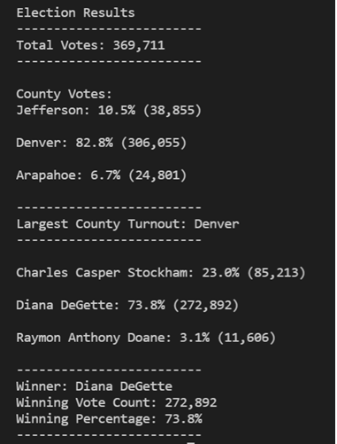

# Pypoll - Election Analysis

## Overview of Election Audtit

A Colorado Board of Elections employee has given us the following tasks to complete the election audit of a recent local congressional election.
- Calculate the total number of votes cast.
- Get a complete list of candidates who received votes.
- Calculate the total number of votes each candidate received.
- Calculate the percentage of votes each candidate won.
- Determine the winner of the election based on popular vote.

## Election Audit Results

The analysis of the election shows that:
- There were 369,711 votes cast in the election
- The breakdown of votes by county is the following:
  - Jefferson had 10.5% of the vote with 38,855 votes
  - Denver had 82.8% of the vote with 306,055 votes
  - Arapahoe had 6.7% of the vote with 24,801 votes
- The county with the largest number of vote was: Denver
- The breakdown of votes by candidate is the following:
  - Charles Casper Stockham received 23.0% of the vote and 85,213 number of votes
  - Diana DeGette received 73.8% of the vote and 272,892 number of votes
  - Raymon Anthony Doane received 3.1% of the vote and 11,606 number of votes
- The winner of the election was: 
  - Diana DeGette who received 73.8% of the vote and 272,892 number of votes

Below you will find an output of the results from the Terminal.

## Election Audit Summary

This script can be used for other elections by modifying the following, below you will find two specific examples: 
1. Change resources file to use other input data, this would require to change the *file_to_load* path from our script to make sure we are using the appropriate input data.
2. In addition to obtaining the information from the candidates and county, in another election maybe we would also receive a breakdown if the vote was casted via mail, e-mail or in person. If this is the case, we would want to conduct an analysis for each of these categories, this would require to add a line in the code which gets the vote source such as the *candidate_name = row[2]* or *county_name = row[1]* that we currently have in our script.

